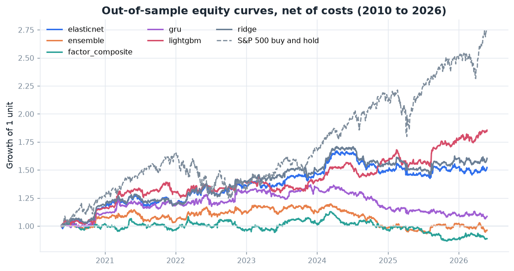
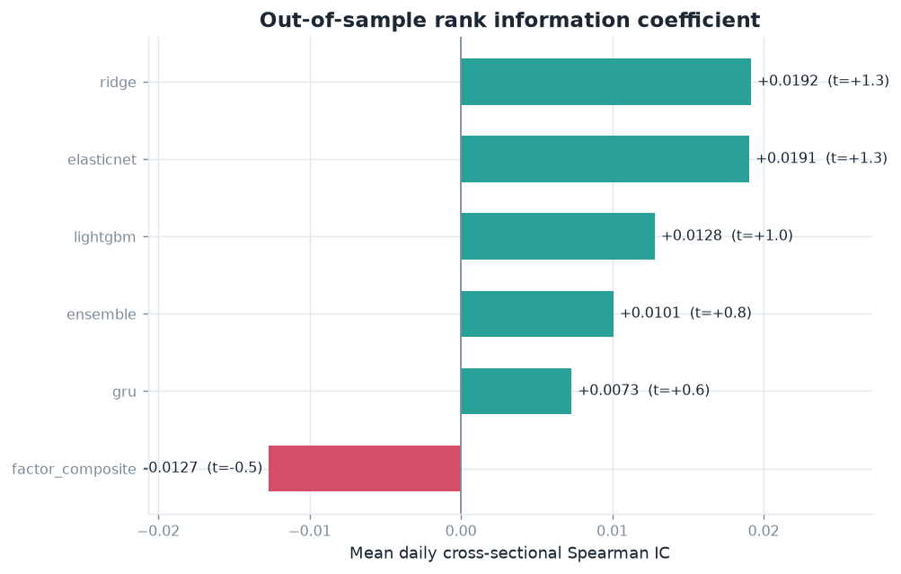
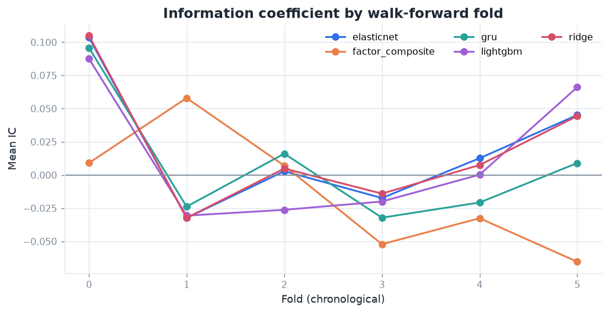

# StockRank

Ranking S&P 500 stocks by how much they will beat each other over the next month, then turning that ranking into a market-neutral long/short portfolio and testing whether the result actually holds up.

[](https://github.com/adwitiyashukla/stockrank/actions/workflows/ci.yml)
[](https://www.python.org/downloads/)
[](LICENSE)
[](https://huggingface.co/spaces/adwitiyashukla/stockrank)

Live demo: [huggingface.co/spaces/adwitiyashukla/stockrank](https://huggingface.co/spaces/adwitiyashukla/stockrank)

## Why I did not build a price predictor

When I started this I was going to do the usual thing, feed prices into an LSTM and predict tomorrow's close. Then I worked out why every project like that reports an R-squared of 0.99 and means nothing.

Tomorrow's price is almost exactly today's price. A model can copy today's number, score beautifully on every regression metric, and contain zero information. The metric is measuring the wrong thing.

So I changed the question. Instead of "what will this stock be worth tomorrow", I asked "out of these 250 stocks, which ones beat the others over the next month". That is a ranking problem, not a level problem, and it is what a systematic equity desk actually does. It also has a much harsher scoreboard: the information coefficient, which is the daily cross-sectional rank correlation between what I predicted and what happened. Real equity signals live around 0.02 to 0.05. Anything near 0.10 in a backtest like this is almost always a leak.

## Getting the data right

I used daily split- and dividend-adjusted OHLCV from Yahoo Finance, from 2010-01-04 to 2026-06-29.

The part that took the most thought was survivorship bias. If I take today's S&P 500 list and run it back sixteen years, I am secretly telling the backtest which companies survived. Every one of those firms made it. The failures are missing, so returns look better than they were.

To deal with this I rebuilt the index membership historically. I scraped the current constituents from Wikipedia, then scraped the table of additions and removals, then walked backwards through those changes undoing them one by one. That turned 503 current members into 813 distinct historical members, including names like Alcoa, Aetna and Monsanto that are long gone from the index.

I could only price 647 of those 813, which is 79.6% coverage, because Yahoo drops most delisted and acquired tickers. So some bias remains and I report the exact coverage number on every run rather than hiding it. That felt more useful than pretending the problem was solved.

I also pulled the real Fama-French five factors plus momentum from the Ken French Data Library, so I could check later how much of my return was just cheap factor exposure.

After filtering to the 250 most liquid names by median dollar volume I had 952,019 rows over 4,146 trading days.

## Building the features and the labels

I built 36 factors out of price and volume: momentum over several windows, volatility, trend and moving-average distances, RSI, MACD, liquidity, Amihud illiquidity, rolling CAPM beta and residual volatility.

Every factor gets winsorised at 1% and z-scored within each date. This matters more than it sounds. A 3% move in a quiet utility and a 3% move in a volatile semiconductor are not the same event, and normalising across the cross-section each day is what makes them comparable.

The label is the 21-day forward return, cross-sectionally demeaned, and entered one day after the signal. That one-day lag is deliberate. If I form a signal from Monday's close I cannot also trade at Monday's close, so the book goes on at Tuesday's close and the return is measured from there.

### Picking the horizon with a diagnostic instead of a guess

I did not want to just pick 21 days because it sounded reasonable, so I wrote `scripts/factor_diagnostics.py`, which screens every factor against forward returns at 1, 5, 10, 21 and 63 days.

Mean absolute IC came out at 0.005 at one day and rose to 0.018 at 63 days. Longer horizons carry more signal, which makes sense, but 63-day labels give me far fewer independent observations to test on. I went with 21 days because it gets close to the 63-day signal strength while giving three times more independent periods, and because turnover at a monthly horizon is low enough that costs do not eat everything.

## Two things I tried that turned out to be wrong

This is the part I learned the most from, so I am leaving it in.

### A beta-adjusted target

My first idea was to predict the return left over after subtracting each stock's market exposure, since my book was going to be market neutral anyway. It produced the strongest information coefficients in the whole study, `beta_63` at -0.084 with a t-statistic of -4.1, and I was pleased with myself for about an hour.

Then I worked out why. The rolling beta I subtract is an estimate, and estimation error in that beta is negatively correlated with the residual by construction. The model was not finding a signal, it was finding my own measurement error. And because I neutralise beta in the portfolio anyway, it could never have earned a rupee. I dropped the target.

### A volatility-scaled target

Dividing forward return by trailing volatility looked like a clean way to make the target risk-adjusted. It is also mechanically anti-correlated with every volatility factor I have, through its own denominator. The information coefficients went up and none of it was tradable. Dropped that too.

Both experiments are reproducible from the diagnostics script if anyone wants to check.

## Validation, and why ordinary cross-validation fails here

A 21-day label formed on the first of the month is still being realised at month end. If that observation sits in training and a date two weeks later sits in testing, the two share most of the same price path. Ordinary k-fold, and even a plain chronological split, leaks.

So I used purged walk-forward cross-validation with 6 folds, a 22-day purge and a 21-day embargo. Purging drops training rows whose label window overlaps the test window at all, and the embargo adds a buffer after it. Every model only ever sees the past and is scored on the future.

I wrote two tests to catch myself if I ever get this wrong. One corrupts the last 60 days of the panel, rebuilds every feature, and asserts nothing stamped earlier moved. The other plants exactly zero alpha into a synthetic market and fails the build if any model finds signal in it. If I ever write a look-ahead bug, those tests break.

## The models

- Ridge and elastic net, as baselines. If four hundred boosted trees cannot beat ridge on the same features then the extra machinery is decoration.
- LightGBM with a Huber objective, because forward returns have fat tails and squared error lets a few earnings gaps dominate the fit.
- A GRU over 40-day sequences of the factor exposures, so it can in principle see momentum that is accelerating versus momentum that is rolling over.
- A rank-average ensemble of the above.
- A factor composite that fits nothing at all. It is a fixed combination of published anomalies: momentum, one-month reversal, low volatility, betting against beta and illiquidity. Since it has no parameters it cannot overfit, so every trained model has to beat it to justify itself.

## Turning a forecast into a portfolio

A prediction is not a portfolio, and this is where I made my worst mistake.

I built a dollar-neutral book, 25 long and 25 short, equal money on each side. It lost 28% a year while having a positive information coefficient, which made no sense to me at first.

The reason is that equal dollars long and short is not the same as market neutral. My model liked low-volatility names on the long side and high-beta names on the short side, so the book was carrying a large negative beta. In a rising market that loses money no matter how good the stock picking is.

The fix is to strip the market exposure out of the weight vector. I do it as a single least-squares residualisation against both the vector of ones and the vector of betas, which zeroes the dollar exposure and the beta exposure at the same time. Doing the two projections one after the other does not work, because the second one undoes the first. There is a test that fails if net beta is ever non-zero.

On top of that: 10% annualised volatility target from trailing data only, a position cap, and a turnover cap.

Costs are 5bp commission, 2bp slippage and 50bp annual borrow on the short leg. The book is marked to market daily rather than booking one lump return per holding period, which matters more than it sounds. See the results section.

## What I actually got

Everything below is out of sample and net of costs.

| Model | Mean IC | t (NW) | Ann. return | Sharpe | Max DD | Beta |
|---|---|---|---|---|---|---|
| `ridge` | +0.0192 | +1.31 | +8.38% | 0.83 | -14.87% | 0.091 |
| `elasticnet` | +0.0191 | +1.29 | +7.50% | 0.76 | -14.69% | 0.106 |
| `lightgbm` | +0.0128 | +1.00 | +10.83% | 1.06 | -10.52% | 0.128 |
| `ensemble` | +0.0101 | +0.76 | -0.22% | -0.02 | -22.05% | 0.077 |
| `gru` | +0.0073 | +0.58 | +1.83% | 0.19 | -22.13% | 0.087 |
| `factor_composite` | -0.0127 | -0.52 | -1.52% | -0.15 | -23.21% | -0.011 |

LightGBM came out best:

- Deflated Sharpe 0.623, against a selection-adjusted threshold of 0.94 for 60 trials
- Bootstrap 95% confidence interval for the Sharpe: [0.29, 1.83], with P(Sharpe <= 0) = 0.003
- Probability of backtest overfitting 0.029, by CSCV
- Fama-French six-factor alpha +6.23% a year, t = 1.67 under Newey-West errors, R-squared 0.180
- Net beta is zero at every rebalance by construction. The full-sample regression beta against the index is 0.128, which is leftover estimation error in the rolling betas rather than a deliberate market bet
- Break-even cost is roughly 55bp per unit of turnover

### What the numbers actually say

The raw numbers look good. Sharpe 1.06, a Newey-West t of 2.67, bootstrap probability of a non-positive Sharpe of 0.003, and a low overfitting probability.

But two things stop me claiming I found something. The deflated Sharpe of 0.623 is below the usual 0.95 bar, which means once you account for the 60 configurations I tried, my Sharpe sits only a little above what a worthless strategy would be expected to reach just by searching. And the six-factor alpha carries a t-statistic of 1.67, which is not significant, so a good chunk of the return is factor exposure anyone can buy cheaply.

My conclusion is that price and volume alone carry very little cross-sectional information in US large caps. I would rather report that than tune the thing until the number looks impressive, and the whole point of building the statistical machinery was to be able to tell the difference.

### A bug that inflated the Sharpe by 4.58x

Worth writing down because of how it was caught. My first backtest engine booked one lump return per 21-day holding period and spread it evenly across the days. Every statistic was then computed on that daily series, and LightGBM reported a Sharpe of 4.58 while its information coefficient was 0.013.

Those two numbers cannot both be true, and noticing that is what found the bug. Spreading one period return across 21 identical days produces a series with almost no day-to-day variation, so the standard deviation is far too small, but annualising still multiplies by the square root of 252 as if those days were independent. The Sharpe gets inflated by roughly the square root of the holding period. The square root of 21 is 4.58. Dividing the reported 4.58 by 4.58 gives 1.0, which is what the fixed engine produces.

The engine now marks the book to market daily using the actual daily returns of the holdings, and there is a test that fails if the returns ever look artificially smooth again.







Full numbers and every figure: [reports/RESULTS_baseline.md](reports/RESULTS_baseline.md)

## A side study on volatility

Return levels are close to unpredictable. Return variance is not, so I compared GARCH(1,1) with Student-t errors, HAR-RV and RiskMetrics EWMA out of sample under QLIKE, which is robust to the fact that true variance is never observed. It sits in `models/volatility.py` and the results are in the report.

## Running it yourself

```bash
git clone https://github.com/adwitiyashukla/stockrank.git
cd stockrank
python -m venv .venv && .venv\Scripts\activate
pip install -e ".[all]"

python scripts/fetch_data.py --config configs/default.yaml
python -m stockrank.cli run --config configs/default.yaml

streamlit run dashboard/app.py
uvicorn stockrank.api.main:app --port 8000
```

No API keys needed, everything comes from public sources. `make run-fast` uses a reduced config that finishes in about two minutes, and `make control` runs the two synthetic control experiments with no network at all.

I built and ran all of this on a laptop with 8 GB of RAM and no GPU. The full pipeline takes 9.2 minutes with the data cached. The sequence models read from one 146 MB feature tensor instead of materialising every training window separately, which is the thing that keeps a GRU trainable on a machine like mine.

## What is in the repo

```
src/stockrank/
  config.py            typed config, one YAML per experiment
  experiment.py        orchestration
  cli.py               run, rebacktest, fetch, report, models, list-runs
  data/                point-in-time universe, resumable ingestion, simulator, cleaning
  features/            36 factors, cross-sectional normalisation, labels
  validation/          purged walk-forward and purged k-fold
  models/              linear, gbm, sequence, ensemble, volatility, factor composite
  portfolio/           sizing, neutrality constraints, volatility targeting
  backtest/            daily mark-to-market with costs and turnover cap
  evaluation/          IC, performance, deflated Sharpe, PBO, attribution
  explain/             SHAP and importance stability
  reporting/           figures and generated results document
  api/                 FastAPI service
dashboard/             Streamlit console
tests/                 leakage guards, null control, accounting invariants
configs/               default, fast, leakage_control, signal_recovery, real_market
scripts/               fetch_data, factor_diagnostics, prepare_demo
```

## Tests

```bash
pytest
ruff check src tests dashboard scripts
```

57 tests, no network needed. They all run on the synthetic simulator so the numbers are identical on any machine. The ones actually worth reading:

| Test | What it proves |
|---|---|
| `test_leakage.py::test_features_are_causal` | corrupting the last 60 days changes nothing stamped earlier |
| `test_leakage.py::test_purged_splits_never_overlap` | train and test share no dates and the gap covers the label horizon |
| `test_null_control.py::test_null_alpha_gives_zero_information_coefficient` | with zero planted alpha, no model may report a reliable IC |
| `test_null_control.py::test_planted_alpha_is_recovered` | the mirror image, so a pipeline that always returns zero cannot pass by doing nothing |
| `test_portfolio.py::test_beta_neutrality_removes_net_beta` | the projection actually zeroes net beta |
| `test_backtest.py::test_returns_are_not_artificially_smooth` | the Sharpe is not inflated by the holding period |

## Deploying it

```bash
docker compose -f docker/docker-compose.yml up --build
```

API on 8000, dashboard on 8501. The live demo runs as a Docker Space on Hugging Face. Details in [docs/DEPLOYMENT.md](docs/DEPLOYMENT.md).

## What I know is still wrong with it

- About 20% of the historically correct index members cannot be priced, so some survivorship bias is still in there
- Costs are linear in turnover. There is no market impact model, and at real size impact is concave in participation rate and would hurt more
- Fills are assumed at the close with a one-day lag, which ignores auction risk
- Price and volume only. No fundamentals, no analyst revisions, no short interest, no options-implied data. If I extend this, that is the first thing I would add, and I think it would matter more than any modelling change
- US large caps only. I would not assume any of this transfers to small caps or other markets without re-testing
- The deflated Sharpe uses an assumed trial count, so multiple testing is bounded but not eliminated. Every configuration I ever ran adds to the real count

## License

MIT
