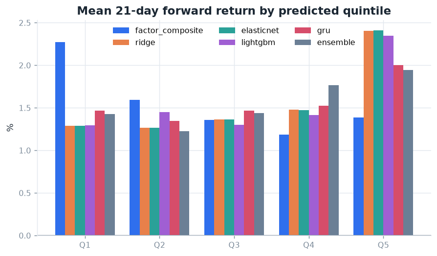
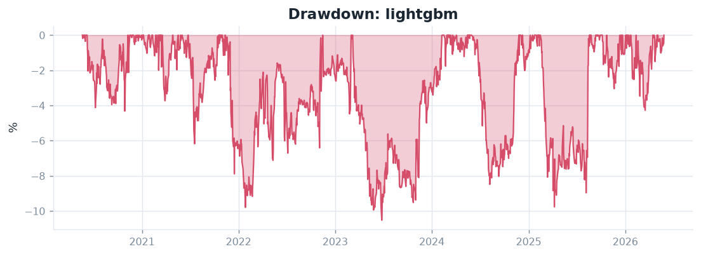
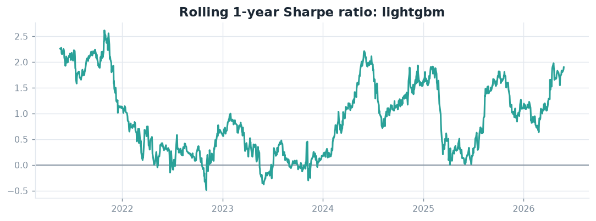
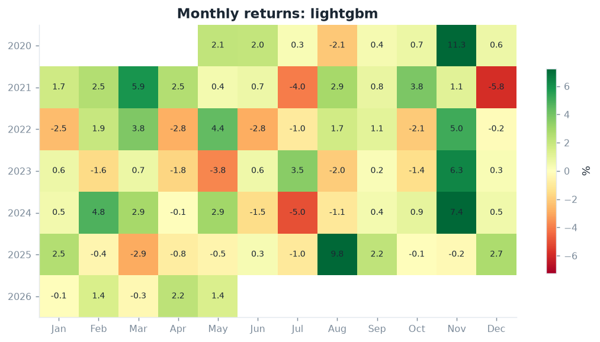
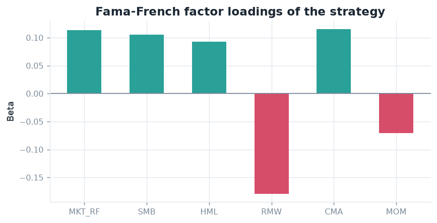
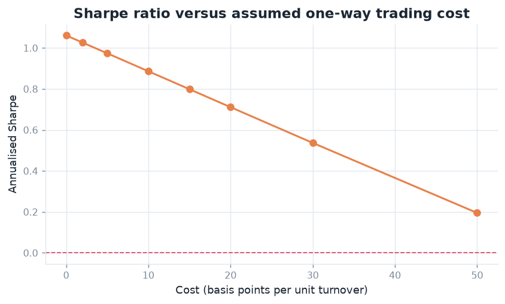
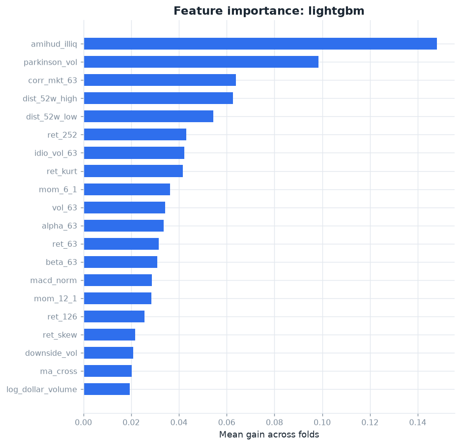
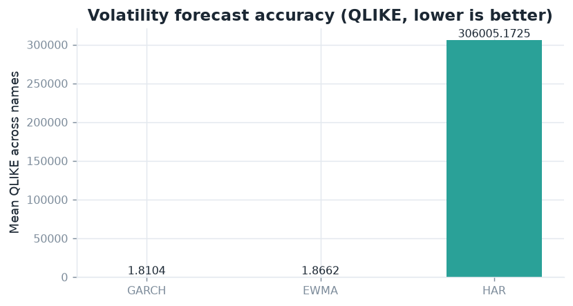

# Results: `baseline`

All figures are out of sample, net of commission, slippage and short financing.

## 1. Dataset

- **Source**: yfinance, universe `sp500_pit`
- **Period**: 2010-01-04 to 2026-06-29 (4,146 trading days)
- **Cross-section**: 250 names, 12 GICS sectors, 952,019 rows
- **Point-in-time coverage**: 647 of 813 historical index members priced (79.6%)
- **Features**: 36 cross-sectionally normalised factors, target = forward_excess_return over 21 days with a 1-day execution lag

## 2. Forecast quality

IC is the daily cross-sectional Spearman correlation between forecast and realised forward return.

| model | mean IC | ICIR | t (Newey-West) | Q5-Q1 | OOS R2 | fit (s) |
| --- | --- | --- | --- | --- | --- | --- |
| ridge | 0.0192 | 2.0165 | 1.3077 | 0.0112 | -0.0043 | 2.1000 |
| elasticnet | 0.0191 | 2.0219 | 1.2897 | 0.0113 | -0.0028 | 77.0000 |
| lightgbm | 0.0128 | 1.5333 | 1.0025 | 0.0105 | -0.0007 | 14.9000 |
| ensemble | 0.0101 | 1.1386 | 0.7582 | 0.0052 | -4.2365 | 0.0000 |
| gru | 0.0073 | 0.7827 | 0.5795 | 0.0054 | -0.0044 | 440.3000 |
| factor_composite | -0.0127 | -0.8844 | -0.5170 | -0.0089 | -21.7247 | 0.0000 |




## 3. Strategy performance

Construction: rank_long_short, 25 long and 25 short, dollar neutral, gross leverage 1.0x, targeting 10% annualised volatility, rebalanced every 21 days. Costs: 5 bp commission plus 2 bp slippage per unit of turnover, plus 50 bp annual borrow on the short leg.

| strategy | ann. return | ann. vol | Sharpe | Sortino | max DD | Calmar | t (NW) | beta to mkt |
| --- | --- | --- | --- | --- | --- | --- | --- | --- |
| factor_composite | -0.015 | 0.098 | -0.155 | -0.251 | -0.232 | -0.065 | -0.409 | -0.011 |
| ridge | 0.084 | 0.101 | 0.833 | 1.237 | -0.149 | 0.564 | 2.204 | 0.091 |
| elasticnet | 0.075 | 0.099 | 0.759 | 1.128 | -0.147 | 0.511 | 2.001 | 0.106 |
| lightgbm | 0.108 | 0.102 | 1.061 | 1.613 | -0.105 | 1.029 | 2.667 | 0.128 |
| gru | 0.018 | 0.096 | 0.191 | 0.283 | -0.221 | 0.083 | 0.493 | 0.087 |
| ensemble | -0.002 | 0.091 | -0.024 | -0.035 | -0.221 | -0.010 | -0.060 | 0.077 |
| benchmark_buy_hold | 0.183 | 0.170 | 1.076 | 1.450 | -0.245 | 0.748 | 2.915 |  |








## 4. Is the result real?

Best strategy by Sharpe: **lightgbm**

- **Deflated Sharpe Ratio**: 0.623. Observed annualised Sharpe 1.06, versus a selection-adjusted threshold of 0.94 implied by 60 trials.
- **Stationary bootstrap 95% CI for the Sharpe**: [0.29, 1.83], P(Sharpe <= 0) = 0.003.
- **Probability of backtest overfitting** (CSCV over 6 candidate strategies, 70 splits): 0.029.
- **Randomisation test**: shuffling forecasts within each date 100 times gives p = 0.010.

### Factor attribution

Daily strategy excess returns regressed on the Fama-French five factors plus momentum, Newey-West standard errors.

| strategy | alpha (ann.) | t(alpha) HAC | R2 | b_mkt | b_smb | b_hml | b_mom |
| --- | --- | --- | --- | --- | --- | --- | --- |
| factor_composite | -0.055 | -1.458 | 0.031 | 0.002 | 0.041 | 0.088 | 0.079 |
| ridge | 0.034 | 0.941 | 0.161 | 0.100 | 0.146 | 0.102 | 0.012 |
| elasticnet | 0.023 | 0.654 | 0.177 | 0.115 | 0.139 | 0.100 | 0.014 |
| lightgbm | 0.062 | 1.672 | 0.180 | 0.113 | 0.105 | 0.093 | -0.071 |
| gru | -0.034 | -0.988 | 0.123 | 0.109 | 0.098 | 0.083 | -0.011 |
| ensemble | -0.050 | -1.401 | 0.145 | 0.086 | 0.141 | 0.081 | 0.012 |



## 5. Implementability

Sharpe as a function of the assumed one-way cost.

| cost (bp) | ann. return | Sharpe |
| --- | --- | --- |
| 0.000 | 0.108 | 1.061 |
| 2.000 | 0.105 | 1.026 |
| 5.000 | 0.100 | 0.974 |
| 10.000 | 0.091 | 0.886 |
| 15.000 | 0.082 | 0.799 |
| 20.000 | 0.073 | 0.711 |
| 30.000 | 0.056 | 0.537 |
| 50.000 | 0.021 | 0.195 |



## 6. What the model uses



## 7. Volatility forecasting study

GARCH(1,1) with Student-t errors, HAR-RV and EWMA compared out of sample under QLIKE.

| metric | mean across names |
| --- | --- |
| qlike_ewma | 1.866186 |
| mse_ewma | 0.000030 |
| qlike_har | 306005.172469 |
| mse_har | 0.000030 |
| qlike_garch | 1.810432 |
| mse_garch | 0.000029 |



## 8. Limitations

1. About 20% of historical index members cannot be priced, so some survivorship bias remains.
2. Costs are linear in turnover, no market impact model.
3. Fills assumed at the close with a one-day lag.
4. Price and volume only, no fundamentals, revisions or short interest.
5. US large caps only.
6. The deflated Sharpe uses an assumed trial count, so multiple testing is bounded but not eliminated.

## 9. Reproducing this run

```bash
pip install -e ".[all]"
python scripts/fetch_data.py --config configs/baseline.yaml   # or your config
python -m stockrank.cli run --config configs/baseline.yaml
```

Wall clock on the reference machine (8 GB RAM, CPU only): data 0s, features 20s, training 456s, backtest 8s, total 572s. Seed `42`.
